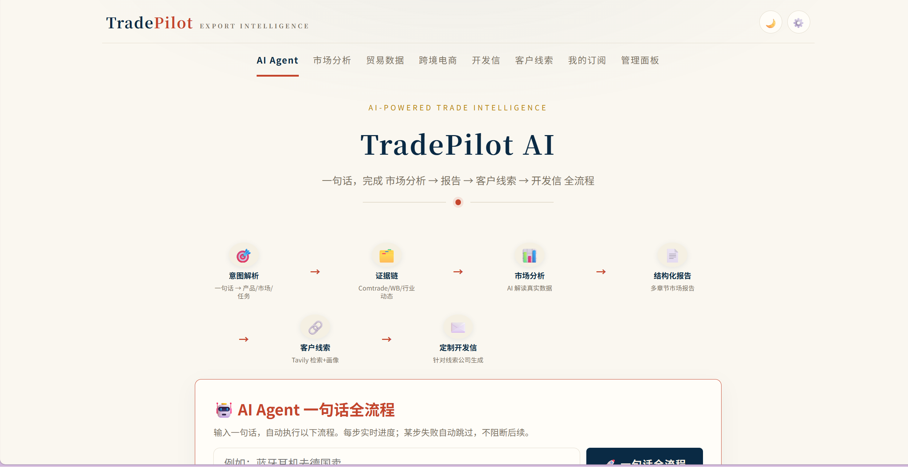
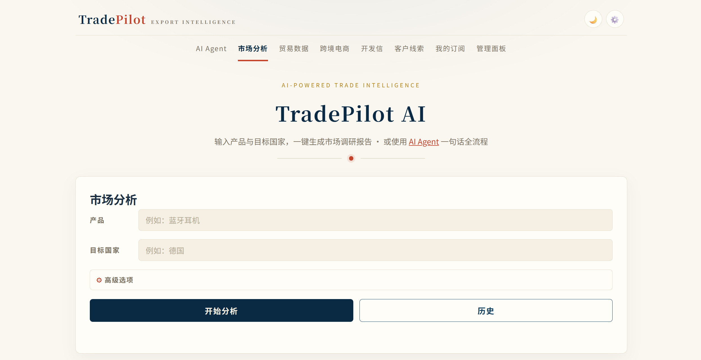
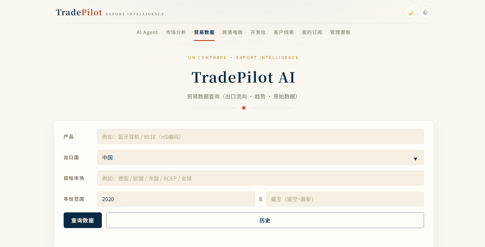
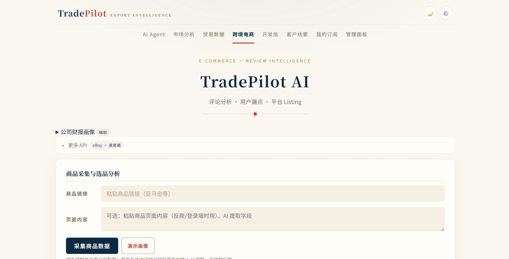
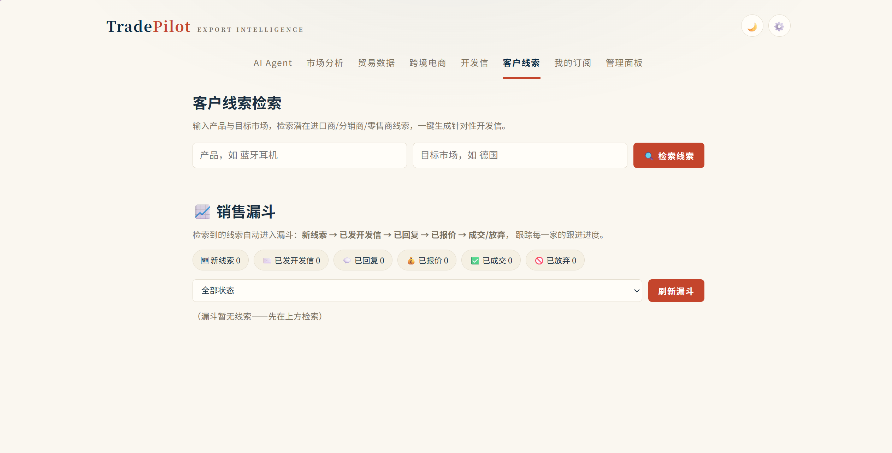
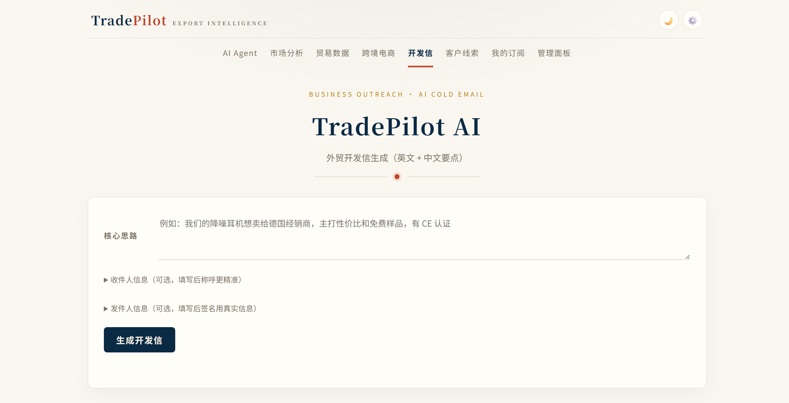
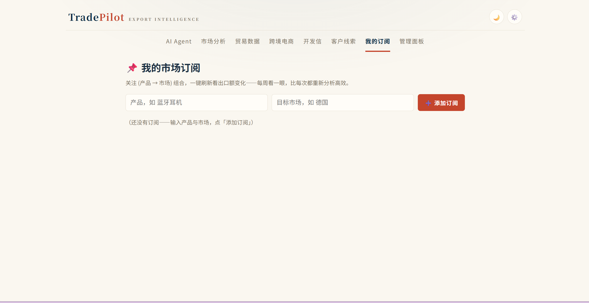

# TradePilot AI — 跨境贸易智能平台

> 面向消费电子出海的 **AI 市场分析与业务辅助平台**（v1.0.3 稳定版）。
> 一句话：输入产品 + 目标国家，**30 秒出报告**——市场分析、贸易数据、竞品画像、客户线索、定制开发信全流程跑通。

<p align="center">
  <a href="https://github.com/MLINK-70/TradePilot-AI/releases/latest"></a>
  <a href="https://github.com/MLINK-70/TradePilot-AI/blob/main/LICENSE"></a>
  <a href="https://github.com/MLINK-70/TradePilot-AI/stargazers"></a>
  
  
  
</p>

---

## ✨ 一句话体验



输入「**蓝牙耳机去德国卖**」→ AI Agent 自动完成：

1. **意图解析** —— 一句话拆出产品/市场/任务
2. **证据链聚合** —— 调 UN Comtrade / World Bank / WTO 五层真实数据
3. **AI 市场分析** —— 摘要五段式、趋势图、品牌画像、法规风险、行动路线
4. **结构化报告** —— Word/PDF 学术式排版（封面/目录/图表/页码）
5. **客户线索** —— Tavily 检索 + 防幻觉硬约束 + 销售漏斗
6. **定制开发信** —— 针对该公司的英文开发信 + 中文要点

每步失败自动跳过，最后汇总「完成 X/6 步」。

---

## 🎯 核心能力

| 模块 | 能力 |
| --- | --- |
| **🤖 AI Agent 一句话全流程** | SSE 流式六步流水线，失败步骤自动跳过，端到端跑通 |
| **市场分析** | 产品+国家 → 结构化报告 + 多国横向对比 + 历史记录 + 多平台（DeepSeek/GPT/Claude） |
| **贸易数据** | HS 编码 → 出口数据 + 趋势图 + AI 解读 + **竞争力指标（TC + 市场份额）** + 定价建议 |
| **外贸开发信** | 英文开发信（含真实数据引用）+ 跟进邮件 + 产品介绍+FAQ + AI 模拟客户 |
| **跨境电商** | 商品采集（URL/粘贴）+ 评论分析 → 痛点报告 + 竞品对比 + 平台 Listing + eBay/速卖通 |
| **客户线索** | Tavily 检索 + 防幻觉硬约束 + 定向开发信闭环 + **销售漏斗** |
| **我的订阅** | 持续监控（产品→市场）组合，一键刷新看出口额变化 |
| **管理面板** | 拦截记录 + 服务器 Key 状态（管理员权限保护） |

---

## 📸 产品截图

<div align="center">

### 市场分析 · 完整报告



### 贸易数据 · 趋势 + 竞争力



### 跨境电商 · 商品采集与评论分析



### 客户线索 · Tavily 检索 + 销售漏斗



### 开发信 · 英文 + 中文要点



### 我的订阅 · 持续监控



</div>

---

## 🚀 快速开始

### 1. 克隆与安装

```bash
git clone https://github.com/MLINK-70/TradePilot-AI.git
cd TradePilot-AI
python -m venv venv
venv\Scripts\activate        # Windows
pip install -r requirements.txt
```

### 2. 配置 API Key

复制 `.env.example` 为 `.env`，至少填入 AI Key（DeepSeek 默认，可选 GPT/Claude/自定义）：

```bash
copy .env.example .env       # Windows
# 编辑 .env：填入 DEEPSEEK_API_KEY
```

其余 Key 可选：Tavily（行业动态/线索检索）、eBay/速卖通（商品分析增强）、UN Comtrade 正式接口（贸易数据推荐）。

### 3. 启动服务

```bash
python -m uvicorn main:app --host 127.0.0.1 --port 8000
```

浏览器打开 <http://127.0.0.1:8000>，导航到 AI Agent 页输入「蓝牙耳机去德国卖」体验完整流程。

### Docker（可选）

```bash
docker compose up
```

服务跑在 `:8000`，报告导出含 LibreOffice + CJK 字体。

---

## 🏗️ 架构与设计

**五层真实数据证据链** —— 统计指标程序精确计算、AI 只解读不参与算术：

| 层 | 数据源 | 内容 |
| --- | --- | --- |
| L1 | UN Comtrade（贸易） | HS 编码出口/进口、单价、份额、TC 竞争力 |
| L2 | World Bank（经济） | GDP / 人口 / 人均 GDP / 互联网普及率 / CPI |
| L3 | Tavily（行业动态） | 新闻检索、龙头品牌、产业链、变动原因 |
| L4 | WTO（宏观背景） | 全球贸易展望、关税风险、驱动因素 |
| L5 | TC 竞争力指标 | 市场份额 + 贸易竞争力指数（程序计算） |

**数据红线：宁缺勿错** —— UN Comtrade 原始"明细行"按 `customsCode` × `motCode` × `partner2Code` 拆成数百行，本项目按 `C00+mot=0+partner2=0` 聚合 + 去重 + DataGate 四态质量校验（valid / suspicious / invalid / rejected），绝不用残缺数据给一个"看起来合理"的错误数字。

**AI 边界** —— AI 只负责**解读**已核实的数字、生成自然语言结论、扩写开发信/产品介绍，**绝不参与算术**（CAGR/TC/份额/单价都是程序算的）。所有外部网页检索用 `<evidence>` 界符包裹 + 指令视为数据，防御提示词注入。

---

## 📦 项目结构

```
TradePilot-AI/
├── main.py              # FastAPI 入口：路由 + 报告渲染
├── config.py            # 密钥 + AI/搜索 base URL 白名单
├── llm.py               # 多 AI 提供商 + single-flight + LRU + 注入防线
├── prompts.py           # 9 字段 JSON 协议系统提示词
├── trade.py             # 贸易数据：UN Comtrade 聚合 + DataGate + 矩阵
├── market_data.py       # World Bank + Tavily 行业 + WTO 宏观 + 竞争格局
├── business.py          # 开发信 / 跟进 / 产品介绍 / 模拟客户
├── ecommerce.py         # 评论分析 / 商品画像 / 竞品对比 / Listing
├── leads.py             # 客户线索 + 防幻觉硬约束 + 定向开发信
├── agent.py             # AI Agent 编排（SSE 流式六步）
├── pricing.py           # 定价建议（出口单价 + 市场均价 → 建议区间）
├── financials.py        # SEC 美股 / 东方财富 A 股 / 非上市白名单
├── collectors.py        # 商品采集（URL/粘贴）+ SSRF DNS rebinding IP 钉扎
├── database.py          # SQLite + WAL + TTL + 血缘 + DataGate
├── export.py            # Word / PDF / CSV 学术式排版（python-docx）
├── static/              # 前端（七页面 + 主题切换 + 书签工具）
├── docs/screenshots/     # README 截图素材
├── tests/               # 139 项 pytest 单元测试 + 回归测试
└── .github/workflows/   # GitHub Actions CI
```

**分层设计**：`config → llm → main → 业务模块（trade/business/ecommerce/leads/agent）`，`llm.py` / `prompts.py` / `database.py` 是所有模块共用的底座。

---

## 🧪 测试与质量

- **139 项 pytest 全部通过**（约 30 秒，无网络依赖）
- 数据准确性回归（脏数据 8 case + DataGate + 血缘）
- 业务模块回归（pricing 公式 / leads 防幻觉 / agent 步骤）
- 安全回归（SSRF / XSS / 密钥校验）
- **GitHub Actions CI**（lint + 双 OS 测试 + PyInstaller 打包）

---

## 🔧 技术栈

| 层 | 选型 |
| --- | --- |
| 后端 | Python 3.12 / FastAPI / SQLite (WAL) |
| 前端 | 原生 HTML / JS / ECharts / 主题切换 |
| AI | DeepSeek（默认）/ GPT-4o-mini / Claude Sonnet 4.5 / 自定义 OpenAI 兼容 |
| 搜索 | Tavily（默认）/ Serper / 自定义 |
| 报告 | python-docx 学术式排版 / matplotlib 图表 / LibreOffice PDF |
| 安全 | Host 白名单 / 匿名限流 / CSP / SSRF DNS rebinding 钉扎 / 提示词注入防护 |
| 部署 | Docker + docker-compose（含 LibreOffice + CJK 字体） |

---

## 🗺️ 路线图

| 阶段 | 状态 | 模块 |
| --- | :---: | --- |
| ✅ 已完成 | core | 市场分析 / 贸易数据 / 外贸开发信 / 跨境电商 / 客户线索 |
| ✅ 已完成 | core | AI Agent 一句话全流程 / 权限层 / 数据血缘 DataGate / 业务闭环（漏斗/订阅/定价） |
| ✅ 已完成 | core | GitHub Actions CI / Dockerfile / 桌面版 PyWebView |
| ✅ v1.0.1 | fix | UN Comtrade 正确聚合（55 亿→6.88 亿）+ SEC/A 股财务修复 |
| ✅ v1.0.2 | rev | 数据层收口（血缘/DataGate/四态质量）+ 业务闭环 + 安全加固 |
| ✅ v1.0.3 | fix | 竞争力指标/定价恢复（partner2Code 拆行）+ 份额虚高 + IPv4-mapped SSRF + 口径透明 |
| 🔜 v1.1 | refactor | `export.py` / `main.py` 拆分（routers/ + export/ 包）、前端 `common.js` 抽取 |

---

## 📋 更新日志

完整的版本更新说明已迁移至 GitHub Releases：

- [v1.0.3 — 数据准确性修复](https://github.com/MLINK-70/TradePilot-AI/releases/tag/v1.0.3)
- [v1.0.2 — 重大修复合集](https://github.com/MLINK-70/TradePilot-AI/releases/tag/v1.0.2)
- [v1.0.1 — 数据准确性专项](https://github.com/MLINK-70/TradePilot-AI/releases/tag/v1.0.1)
- [v1.0.0 — 正式版](https://github.com/MLINK-70/TradePilot-AI/releases/tag/v1.0.0)

---

## ❓ 常见问题

| 问题 | 解决 |
| --- | --- |
| `venv\Scripts\activate` 报错 | 确认用反斜杠路径；提示符出现 `(venv)` 才算激活成功 |
| 中文乱码 | 所有源码文件保持 UTF-8；终端执行 `chcp 65001` |
| 提示符不出现 `(venv)` | 在项目根目录执行，不要在别的目录激活 |
| 502 错误 | 检查 `.env` 中 Key 是否正确、账户余额是否充足 |
| 开着梯子导致请求失败 | 已内置强制直连（`proxies=None`）；若仍失败确认 DeepSeek 域名未被代理拦截 |
| 端口被占用 | 启动命令加 `--port 8001` |
| 报告导出 PDF 失败 | 本机需装 Word（COM 引擎）或 LibreOffice（Docker 内置） |

---

数据来源：[UN Comtrade](https://comtrade.un.org) · [World Bank Open Data](https://data.worldbank.org) · [Tavily Search](https://tavily.com) · [WTO Global Trade Outlook](https://www.wto.org) · [SEC EDGAR](https://www.sec.gov/edgar) · [东方财富数据中心](https://data.eastmoney.com)
